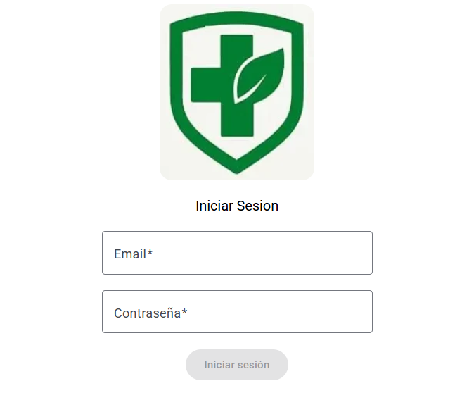
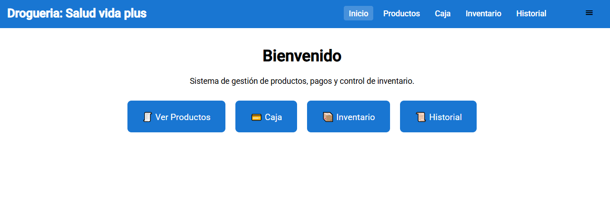
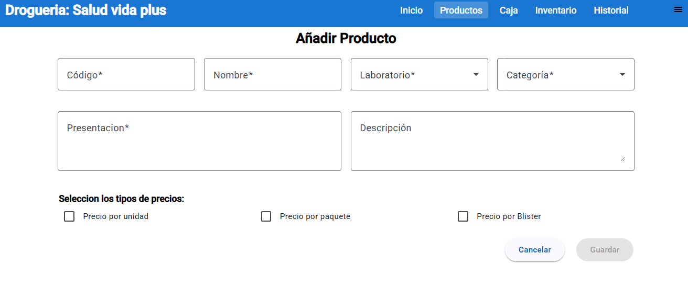
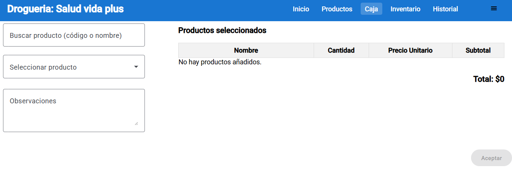

# 💊 Pharmacy Management Web App (Angular)

This is a **web application built with Angular** for managing a **pharmacy system**. The app provides an intuitive interface to handle user authentication, manage product inventory, and perform administrative operations like adding/editing users and products.

It is designed to be used by pharmacy staff (admins and regular users) to easily control inventory, track stock levels, and manage pricing for each product.

## 🧾 Description

The Pharmacy Management App is a frontend interface that interacts with a backend REST API (e.g., Spring Boot). It enables the following core functionalities:

- 🔐 User login and registration using JWT authentication
- 👤 User management (CRUD) for admins
- 📦 Product management with support for multiple price types (purchase/sale)
- 🗂 Inventory display with current stock information
- 🎨 Responsive UI for both desktop and tablet use

---

## 📸 UI Screenshots

> You can place your UI screenshots here by uploading images to your repository and linking them.

### 🟦 Login Page

### 🟨 Home

### 🟩 Product Form

### 🟫 Sell products

---

## ⚙️ Technologies Used

- Angular 19
- TypeScript
- RxJS
- Angular Router
- Angular Reactive Forms
- Angular Material (or Bootstrap)
- JWT Token Authentication (via HTTP Interceptor)
- Integration with Spring Boot REST API
- electron builder

